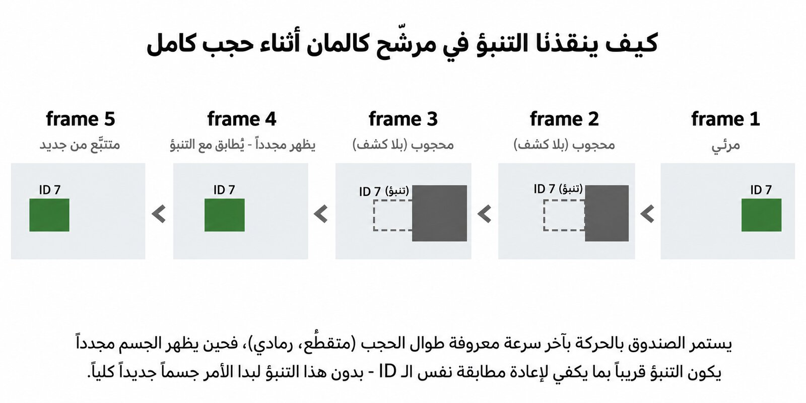

# Week 8 Handoff — Object Tracking

**Read this file completely before doing anything.** It is the full context for
building Week 8 of this course. It is written for an agent starting with zero
prior knowledge of this repository.

This document is a working brief, **not** student-facing material. Do not ship
it in the lesson.

---

## 1. The mission

Build **Week 8: تتبع الأجسام (Object Tracking)** — one Jupyter notebook plus its
assets, inside `Week8/`, matching Week 7 in depth, tone and conventions.

Week 7 (complete) fine-tuned a YOLO model that detects `ambulance` alongside
`car`, `truck`, `bus`. That model **ships inside this repo** and is your starting
point. Week 8 must take it from "detects objects in one frame" to "follows
objects across frames with stable IDs", which is what Week 9 needs in order to
count vehicles and drive signal logic.

---

## 2. The course

Arabic-language computer-vision bootcamp, **"مسار أنظمة المرور الذكية"** (Smart
Traffic Systems track), run by فريق سوريا التقني and مداد.

- Primary repo: `github.com/syriascitech/Computer_Vision_Course`
- Public mirror: `github.com/syriascitech/Medad-CV-Bootcamp` — **live and
  serving files**; this is the URL used in Colab badges and image fallbacks.

| Week | Topic | State |
|---|---|---|
| 1 | Python review, NumPy, image representation | done |
| 2 | OpenCV basics, video, drawing, camera | done |
| 3 | Classical CV: edges, filtering, motion | done |
| 4–5 | Neural networks, CNNs | done |
| 6 | Object detection with pretrained YOLO | done |
| **7** | **Training & fine-tuning** | **done — see §6** |
| **8** | **Object tracking** | **← you are here** |
| 9 | System integration: counting, density, signal logic | not started |
| 10 | Final project | not started |

The running example across weeks 7→10 is **"الإسعاف له الأولوية"** (ambulance
priority): detect an ambulance, track it to know which lane it is in and how
close it is, then give that lane a green light.

---

## 3. The execution model — read this twice

This is the single most important thing in this document, and it changed after
Week 7 was first built. **Get it wrong and you will build the wrong artifact.**

There are three distinct environments, and they have different rules:

### 3.1 Authoring (you, and the course author) — Google Colab

You develop and **execute** the notebook on Colab. Internet is available. A free
T4 GPU is usually available. You install packages with `!pip`, you clone the
repo to get the data, you run every cell.

### 3.2 Shipping — the notebook is committed **with its outputs saved**

When the notebook is correct, it is saved **with all cell outputs intact** and
committed. The outputs are part of the deliverable, not noise.

> **This reverses the rule that applied while Week 7 was first written.** Week 7
> originally stripped outputs. It no longer does — `week_7_training_and_
> finetuning.ipynb` ships with 29 cells of saved output. Do the same for Week 8.

### 3.3 The lecture — nothing is executed

In class the notebook is **opened and read, not run**. Students see the outputs
you generated earlier on Colab: the printed tables, the plots, the detection
grids, the metrics. No cell is executed, no package is installed, no model runs.

**Consequences you must design for:**

1. **Every cell must have a meaningful saved output before you ship.** A cell
   that prints nothing teaches nothing in a read-only lecture. If a cell is
   silent, add a `print()` that shows what it accomplished.
2. **The notebook must read top-to-bottom like a document.** The prose must
   describe what the output below it shows. Never write "run this and see" —
   the reader is not running anything.
3. **Images must render with no network.** Saved matplotlib output is embedded
   as base64 and always renders. Static figures from `media/` are referenced by
   relative path and render from disk. See §5.2 for the required form.
4. **Notebook file size is now a real budget.** Saved outputs are base64 and
   they add up fast. See §4.
5. **`!pip install` cells are acceptable**, because only you run them. Keep them
   at the top, quiet (`-q`), and minimal.
6. **A repo-clone cell is required** so that *you* can fetch the dataset and
   models when running on Colab. Without it, 13 of Week 7's code cells fail on a
   fresh runtime. See §9.2.

### 3.4 Students re-running at home

Some students will click the Colab badge and run it themselves. The notebook
must work end-to-end on a fresh Colab runtime: pip cell, clone cell, then
everything else. Test exactly this path before declaring done.

---

## 4. Size budget

**`Week8/` must stay ≤ 50 MB total, and the notebook itself should stay
under ~8 MB.**

Week 7 reference points:
- notebook with outputs: **7.9 MB** (that is near the ceiling, not a target)
- notebook stripped: 122 KB
- whole `Week7/` folder: 38 MB

Week 8 is video-heavy, so the risk is higher. Budget roughly:

| Item | Target |
|---|---|
| 3 video clips | ≤ 3 MB each, 9 MB total |
| `emergency_best.pt` + `yolo11n.pt` | 11 MB |
| static figures in `media/` | ~5 MB |
| notebook with saved outputs | ≤ 8 MB |
| frames, misc | ~2 MB |

**Keeping saved output small:**
- Set a modest figure DPI once near the top: `plt.rcParams["figure.dpi"] = 90`.
  Default DPI produces very heavy PNGs when multiplied across ~20 figures.
- Prefer `figsize` around `(12, 6)`; avoid `(18, 11)` grids unless necessary.
- **Never use `Video(path, embed=True)`** — it base64-encodes the whole video
  into the `.ipynb`. Week 6's notebook is 6.4 MB almost entirely because of one
  embedded video. See §5.3 for how to show tracking results instead.

---

## 5. Writing conventions — copy these exactly

Open `Week7/week_7_training_and_finetuning_v2.ipynb` — **this is the current
reference implementation**, the Colab-targeted one. Read it before writing.
(`week_7_training_and_finetuning.ipynb` is the older local-only lineage; it
still contains a `drive.mount` cell. Prefer v2 for conventions.)

### 5.1 Arabic markdown cells

Every Arabic markdown cell opens with this exact div:

```html
<div dir="rtl" class="rtl-cell" style="direction:rtl; text-align:right;">

...content...

</div>
```

Content inside is **full HTML** (`<h1> <h2> <h3> <p> <ul> <ol> <table>
<blockquote> <code> <pre>`), **not** raw markdown. This is the only form that
renders reliably in both Jupyter and Colab.

The `<style>` block defining `.rtl-cell` appears **once**, in the title cell.
Copy it verbatim from Week 7. It also defines `<div class="note">` — a grey
callout box used for important asides. Use it.

English technical terms stay in Latin script inside Arabic prose:
`Bounding Box`, `Confidence`, `ID Switch`, `Occlusion`.

### 5.2 Static figures — the required form

Figures are **not** generated by the notebook. Each figure is:

1. An Arabic markdown cell with an `<h4>` heading and a `<p>` explaining what
   the figure shows and why it matters.
2. A markdown cell containing an `` with a **local-first, mirror-fallback**
   source:

```html
<div style="text-align:center; margin:24px 0;">

</div>
```

This resolves from disk when the folder is present, and falls back to the mirror
on a bare Colab runtime. Both URLs are verified live. Use `.jpg`, number figures
sequentially from 1, and set a descriptive English `alt`.

Full specs for every figure go in **`Week8/media/FIGURE_BRIEFS.md`**, which you
must write. Model it on `Week7/media/FIGURE_BRIEFS.md` — read that file; it
holds the shared style guide (palette, sizes, white background, all in-figure
text in English) plus one block per figure. **The course author generates the
images from those briefs. You do not generate them.**

Figures genuinely produced by running code (a detection grid, a plot) are real
code cells whose saved output is the figure.

### 5.3 Showing tracking results without bloating the notebook

Week 8's central output is a tracked video, and this is the hardest thing to ship in
a read-only notebook. In order of preference:

1. **A frame-strip figure** — sample 4–6 frames across the clip, draw the boxes,
   IDs and trails, and lay them out with matplotlib. Cheap, prints inline, reads
   well on a projector, and shows ID stability better than motion does.
2. **A small GIF** written to `media/` and shown with an `` tag — capped at
   2 MB, referenced by relative path (not embedded).
3. **The `.mp4` written to disk** and mentioned in prose for students to open
   themselves. Never embedded.

Ship `videos/reference_tracking_output.mp4` regardless, so the result exists
even if nobody re-runs anything.

### 5.4 Code style

- English variable names, explicit and long: `annotated_frame`, `track_history`.
- Constants `UPPER_CASE` at the top of the cell: `MAX_FRAMES`, `TRACK_IMGSZ`.
- One argument per line when a call has more than two.
- `plt.axis("off")` after every `imshow`.
- **Matplotlib titles and labels in English** — Week 7 does not use
  `arabic_reshaper`, and neither should you.
- `print()` messages in Arabic, **no emoji**: `print("عدد المسارات:", n)`.
- Arabic comments, short and sparse.
- **Every cell should print or plot something.** See §3.3.1.

### 5.5 No emoji

None in headings, none in `print()`, none inside figures. Week 7 has zero.
Earlier weeks used them heavily — do not copy that. Inside figures use text
glyphs `✓` / `✗`, coloured by role.

### 5.6 Cell rhythm

Short markdown header (2–5 lines) → short code cell (5–25 lines). Long
explanation cells only for major concepts. Week 7 is 95 cells: 64 markdown,
31 code.

### 5.7 Required closing sections

- **تمرين صفي** — 4 tasks, plus one or two scaffolded `# TODO:` code cells
- **أسئلة مراجعة سريعة** — 7 open questions, no answers
- **بنك أسئلة Kahoot** — 12 multiple-choice questions **with answers marked**:
  ```html
  <h3>سؤال 1</h3>
  <p><strong>السؤال:</strong> ...</p>
  <ul>
    <li>أ) ...</li>
    <li>ب) ...</li>
    <li>ج) ...</li>
    <li>د) ...</li>
  </ul>
  <p><strong>الإجابة الصحيحة:</strong> ب</p>
  ```
  **Kahoot limits:** question ≤ 120 characters, each option ≤ 75 characters,
  exactly 4 options, exactly 1 correct answer. The author pastes these in by
  hand. Aim for 8 conceptual + 4 applied.
- **الخلاصة** + **في الأسبوع القادم** (tease Week 9: counting, density, signal
  decision)
- **مصادر للاستزادة** — official documentation links

### 5.8 Table of contents must match the body

Week 7 shipped a TOC listing 14 items against 15 body sections. It was fixed in
v2. Count them.

### 5.9 Author line

The title cell contains `<p><strong>المُعد/المؤلف:</strong> </p>` — currently
**blank** in Week 7. Leave it blank for the author to fill in.

---

## 6. What Week 7 delivered — you inherit this

```
Week7/                                       38 MB
  week_7_training_and_finetuning_v2.ipynb    95 cells — CURRENT reference
  week_7_training_and_finetuning.ipynb       older lineage, has drive.mount
  SETUP.md            local-install instructions (predates the Colab switch)
  requirements.txt    ultralytics, torch, torchvision, opencv-python,
                      pandas, matplotlib, pyyaml, ipython
  CREDITS.md          licensing/attribution
  dataset/            682 images, YOLO format, 4 classes, LICENSE.md
  failures/           5 images where pretrained YOLO fails + failures.csv
  models/yolo11n.pt          pretrained COCO weights (5.4 MB)
  models/emergency_best.pt   ← THE FINE-TUNED MODEL YOU NEED (5.2 MB)
  runs_reference/emergency_full/   precomputed training artifacts
  media/              11 figures (.jpg) + FIGURE_BRIEFS.md
  classification_example/train.csv
  student_images/
```

### 6.1 The model you inherit

`Week7/models/emergency_best.pt` — YOLO11n fine-tuned for 60 epochs at
`imgsz=416`. Classes, **in this exact order**:

```python
{0: "ambulance", 1: "car", 2: "truck", 3: "bus"}
```

Performance on the Week 7 test split (69 unseen images):

| Class | Precision | Recall | mAP@50 |
|---|---|---|---|
| ambulance | 0.849 | 0.821 | **0.879** |
| bus | 0.531 | 0.643 | 0.633 |
| truck | 0.703 | 0.355 | 0.515 |
| car | 0.571 | 0.348 | 0.417 |
| **overall** | 0.663 | 0.542 | **0.611** |

**`ambulance` is the strong class — build Week 8 around it.** The weaker `car`
and `truck` numbers are largely a labelling artifact (Open Images does not
exhaustively annotate every car); Week 7 §8 explains this honestly rather than
hiding it.

Already copied for you: `Week8/models/emergency_best.pt` and
`Week8/models/yolo11n.pt`.

### 6.2 The narrative thread to pick up

Week 7 closes by saying: the model now answers "what is this?" and "where is
it?" for each frame independently, but **it forgets everything between frames**
— it does not know the ambulance in frame 10 is the same one from frame 9. So we
cannot yet answer "how many vehicles crossed?" or "how fast is this ambulance
approaching?". That is tracking, and that is Week 8.

**Open Week 8 by paying off exactly that setup.**

---

## 7. Proposed Week 8 structure

Agreed with the author. Adjust detail, keep the shape and depth. Roughly 90–110
cells.

```
0     Colab badge
1-7   Title / objectives / contents / pip install / repo clone /
      imports + offline settings / device check /
      load models/emergency_best.pt

§1  لماذا الكشف وحده لا يكفي؟
    1.1 detection on 3 consecutive frames — "how many cars passed?"   [code]
    1.2 the double-counting problem (numeric: 375 frames x 4 cars = 1500?)
    1.3 Detection vs Tracking table          + فكر قبل المتابعة

§2  تعريف المشكلة: Multi-Object Tracking
    2.1 Track / Detection / ID
    2.2 the Tracking-by-Detection philosophy
    2.3 four challenges: occlusion, similarity, entry/exit, fast motion

§3  الربط بين الإطارات (Data Association)
    3.1 IoU as a similarity measure         [code: write iou() from scratch]
    3.2 the cost matrix                     [figure]
    3.3 the Hungarian algorithm, worked 3x3 by hand   [code: scipy + figure]
    3.4 why greedy matching fails           [runnable counter-example]

§4  التنبؤ بالحركة: مرشّح كالمان
    4.1 intuition: where will the car be next frame?
    4.2 the state vector [x, y, s, r, vx, vy, vs]
    4.3 the predict -> update cycle         [figure]
    4.4 why it saves us during occlusion    [THE key figure]
    Intuition only. Two equations maximum. Week 6/7 depth, not a derivation.

§5  SORT
    5.1 the full pipeline step by step      [figure]
    5.2 track lifecycle: min_hits, max_age  [figure: state machine]
    5.3 its weakness: ID switches           [figure]

§6  DeepSORT: adding appearance
    6.1 Re-ID embeddings   6.2 combined cost   6.3 the price: speed

§7  ByteTrack: the clever simple idea
    7.1 the problem: we throw away low-confidence detections
    7.2 two-stage association, high then low   [THE most important figure]
    7.3 why it survives occlusion
    7.4 comparison table: SORT / DeepSORT / ByteTrack / BoT-SORT

§8  عملياً مع Ultralytics
    8.1 model.track() and persist=True
    8.2 bytetrack.yaml vs botsort.yaml
    8.3 reading boxes.id -> a DataFrame of tracks
    8.4 stream=True to save memory

§9  نبني متتبع IoU مصغّراً من الصفر  (~45 lines, SimpleIoUTracker)
    Deliberately WITHOUT Kalman: greedy IoU matching, max_age=5.
    Purpose: let students SEE an ID switch happen, so they understand why
    Kalman and ByteTrack exist instead of being told.

§10 رسم المسارات Trails وتلوين حسب الـ ID     [frame-strip output, see §5.3]
§11 تشغيل على المقطع الكامل وحفظ الناتج
§12 أول تطبيق: عدّ المركبات بخط عبور   [bridges into Week 9]
    12.1 the line and crossing direction  12.2 code  12.3 why a stable ID
    is what makes this possible at all
§13 متى يفشل المتتبع؟ ID switch / fragmentation / ghost tracks
    + tuning table: track_high_thresh, track_low_thresh, match_thresh,
      track_buffer
§14 كيف نقيس جودة التتبع؟ MOTA / IDF1 / HOTA — conceptual only
§15 تمرين صفي (4 tasks + TODO cells)
§16 أسئلة مراجعة سريعة (7)
§17 بنك أسئلة Kahoot (12)
§18 الخلاصة + في الأسبوع القادم
مصادر للاستزادة
```

### Suggested exercises for §15

1. Change `track_buffer` from 30 to 5, then to 100. Record the total number of
   IDs produced in each case.
2. Swap `bytetrack.yaml` for `botsort.yaml` and compare ID switches visually.
3. Move the counting line elsewhere and explain why the count changed.
4. Run `SimpleIoUTracker` on the ambulance clip and identify the exact frame
   where it loses the ambulance's identity.

---

## 8. Assets you must source

**Critical path — do this first and show the author before writing cells.**

### 8.1 Videos — `Week8/videos/`

| File | Content | Spec |
|---|---|---|
| `traffic_clip.mp4` | Busy traffic, dense enough that vehicles occlude each other | 15 s, 640×360, H.264, ≤ 3 MB |
| `ambulance_clip.mp4` | An ambulance passing through an intersection | 15 s, 640×360, H.264, ≤ 3 MB |
| `reference_tracking_output.mp4` | Precomputed tracking result | ≤ 3 MB |

Source from **licence-free stock** (Pexels, Pixabay, Coverr) and record every
source and licence in `Week8/CREDITS.md`. The ambulance clip ties Week 8 to the
Week 9 priority-signal story — it matters more than the generic one.

Re-encode hard, and strip audio:
```bash
ffmpeg -i in.mp4 -t 15 -vf scale=640:-2 -c:v libx264 -crf 30 -an out.mp4
```

**Ask the author first** whether locally-filmed footage exists. Local traffic
would be far better than Western stock for this audience.

### 8.2 Frames — `Week8/frames/`

Three consecutive frames extracted from `traffic_clip.mp4` for §1.1, so that
section reads without decoding video.

### 8.3 Runtime budget

YOLO11n at `imgsz=416` runs ~100–150 ms/frame on CPU, far faster on a Colab T4.
Since you author on Colab, generous settings are affordable — but students
re-running at home may be on CPU. Keep constants visible and modest:

```python
MAX_FRAMES = 200       # ~8 seconds at 25 fps
FRAME_STRIDE = 2       # process every other frame
TRACK_IMGSZ = 416
```

**Measure the real time and put it in the prose**, so a student knows what to
expect before starting a cell.

---

## 9. Technical gotchas — learned the hard way

Every one of these cost real debugging time in Week 7. Do not rediscover them.

### 9.1 Ultralytics reaches for the network

Put this before any YOLO use:

```python
import os
os.environ["YOLO_VERBOSE"] = "False"
from ultralytics import YOLO, settings
settings.update({"sync": False})          # stops usage analytics
MODEL_PATH = "models/emergency_best.pt"   # local path, so no auto-download
```

- **Weights**: a local path prevents auto-download.
- **AMP check**: `model.train()` downloads `yolo11n.pt` to test AMP; pass
  `amp=False` on CPU. Not relevant unless you train.
- **Fonts**: `result.plot()` downloads `Arial.ttf` **only if labels are
  non-ASCII**. Our class names are ASCII. **Do not put Arabic text through
  `plot()`** — draw it in matplotlib instead.
- **BoT-SORT with ReID**: `botsort.yaml` ships `with_reid: False`. Enabling ReID
  downloads a model. Verify before recommending it in §8.2 of the notebook.
- **Bundled trackers**: `bytetrack.yaml` and `botsort.yaml` ship inside the
  `ultralytics` package (`ultralytics/cfg/trackers/`). Confirm this in your
  environment before relying on it.

### 9.2 The repo-clone cell (Colab)

A fresh Colab runtime has none of the repo files. Without a clone, 13 of Week
7's 31 code cells fail. Add this right after the pip cell:

```python
import os
from pathlib import Path

# على Colab لا توجد ملفات المستودع، فننسخها مرة واحدة.
if not Path("dataset").exists() and not Path("videos").exists():
    !git clone -q https://github.com/syriascitech/Medad-CV-Bootcamp.git /content/repo
    os.chdir("/content/repo/Week8")

print("مجلد العمل:", os.getcwd())
```

Guard it so it is harmless when the files are already present (local run).
**Test the bare-runtime path before shipping.**

### 9.3 Never guess Ultralytics output paths

`project="runs"` is resolved relative to Ultralytics' configured `runs_dir`,
producing surprises like `runs/detect/runs/mini/`. Always ask:

```python
run_dir = Path(model.trainer.save_dir)
```

### 9.4 `data.yaml` and the `path:` trap

Only relevant if you train, but know it. Ultralytics resolves:

```python
path = Path(data.get("path") or Path(data["yaml_file"]).parent)
```

`path: .` resolves against the **current working directory**, not the yaml's
folder, so it silently breaks when launched from elsewhere. **Omit `path:`
entirely** and Ultralytics uses the yaml's own directory.

### 9.5 Ultralytics 8.4 renamed the metric plots

`BoxPR_curve.png`, `BoxF1_curve.png` — **not** `PR_curve.png`.

### 9.6 Video display

Never `Video(path, embed=True)`. See §5.3. Prefer `imageio-ffmpeg` (pip package
bundling its own binary) over system `ffmpeg`.

### 9.7 Make the notebook say what actually happens

In Week 7 the text said "watch the losses drop", but the real run showed
`cls_loss` falling while `box_loss` *rose* — normal early mosaic behaviour. The
prose had to be corrected to match reality. **Run every cell, read the real
output, and make the prose describe that.** In a read-only lecture this matters
more than ever: the output is sitting right there, and a contradiction between
text and output destroys trust instantly.

### 9.8 Bug inherited from Week 6 — do not repeat

Week 6's video cell sets `TARGET_NAMES = {"person", "car"}` but its counter sums
over `{"bicycle", "car", "motorcycle", "bus", "truck"}` — classes that can never
appear. **Derive counted classes from the same set you filter by**, never write
the list twice.

### 9.9 OpenMP duplicate-library crash

On some Windows machines Ultralytics + OpenCV trigger an OpenMP conflict. Week 7
v2 guards against it in the imports cell:

```python
os.environ["KMP_DUPLICATE_LIB_OK"] = "TRUE"
```

Harmless elsewhere; include it. (Week 7 v2 also accidentally imports
`matplotlib.pyplot` and `cv2` twice in that cell — do not copy that.)

---

## 10. Tooling and workflow

### 10.1 Build the notebook from a script

Do **not** hand-edit `.ipynb` JSON. Week 7 uses generator scripts in `tools/`:

- `tools/build_week7_notebook.py` — built the first draft
- `tools/append_week7_sections.py` — **the pattern to follow.** It loads the
  existing notebook, finds a marker cell, truncates from there, and appends.
  Re-runnable *and* preserves cells the author edited by hand.

**The author edits the notebook directly between your turns.** Always diff
before regenerating, or you will destroy their work. Write
`tools/build_week8_notebook.py` in the same append-safe style.

Helpers worth copying verbatim from `append_week7_sections.py`: `rtl(body)`,
`code(src)`, `figure(number, filename)`, `_cell(kind, text)`. Update `figure()`
to emit the `` form from §5.2.

### 10.2 Validate by executing everything

The deliverable is a notebook **with correct saved outputs**, so execution is
not optional. On Colab, run it top to bottom via `Runtime → Run all`, read every
output, then save.

For local checking, a harness like this catches errors fast:

```python
import json, os, time
import matplotlib; matplotlib.use("Agg")
os.chdir("Week8")
nb = json.load(open("week_8_object_tracking.ipynb"))
g = {"__name__": "__main__"}
for i, c in enumerate(nb["cells"]):
    if c["cell_type"] != "code": continue
    src = "".join(c["source"])
    if src.lstrip().startswith("!"): continue   # skip shell cells
    t0 = time.time()
    try:
        exec(compile(src, f"<cell {i}>", "exec"), g)
        print(f"cell {i:3d} OK  [{time.time()-t0:.0f}s]")
    except Exception as e:
        print(f"cell {i:3d} FAIL {type(e).__name__}: {e}")
```

Week 7 reached **30/30 code cells passing**. Week 8 must match.

### 10.3 Structural checks before declaring done

Script these:

- every Arabic markdown cell starts with `<div dir="rtl"`
- zero emoji anywhere
- zero `google.colab` imports and zero `drive.mount` (the clone replaces them)
- every `media/…` image target exists on disk
- every `onerror` fallback URL points at `Medad-CV-Bootcamp/main/Week8/media/…`
- the Colab badge points at **this** notebook's filename, not another one
  (Week 7 v2 got this wrong — its badge opens v1)
- TOC item count equals body section count
- **every code cell has a saved output**
- `du -sh Week8` ≤ 50 MB, notebook ≤ 8 MB

### 10.4 Workflow the author expects

**The author reviews after each stage. Stop and report; do not run ahead.**
Stated explicitly: *"ask to continue before proceeding next section so I can
review and give feedback."*

Suggested stages:

1. Source and encode video assets, extract frames — **show the author the clips
   and sizes before writing any cells**
2. Notebook skeleton: badge, pip, clone, imports, all section headings
3. §1–§4 (why tracking, MOT, association, Kalman)
4. §5–§7 (SORT, DeepSORT, ByteTrack)
5. §8–§12 (Ultralytics in practice, from-scratch tracker, trails, counting)
6. §13–§18 (failures, metrics, exercises, Kahoot, summary)
7. `FIGURE_BRIEFS.md`, `CREDITS.md`, `requirements.txt`
8. Full Colab run to generate outputs, then validation and cleanup

Report findings honestly, including when results are worse than hoped. The most
valuable material in Week 7 came from real measurements contradicting my
assumptions.

---

## 11. Open questions for the author

Ask rather than deciding alone:

1. **Author credit** — the `المُعد/المؤلف:` line is blank in Week 7. Who is
   credited for Week 8?
2. **Videos** — is there locally-filmed footage? Far better than Western stock.
3. **Kalman depth** — §4 is specified as intuition-only. Confirm two equations
   is the ceiling.
4. **Week 9 boundary** — §12's counting line is the bridge. How much belongs in
   Week 8 versus Week 9?
5. **`SETUP.md`** — Week 7's still describes a local venv install, which no
   longer matches the Colab flow. Does Week 8 need one at all, or does the badge
   replace it?

---

## 12. Repo housekeeping (be aware, not yours to fix)

Untracked leftovers in the repo root from Week 7:

- `Emergency Vehicle Detection Dataset.zip` (32 MB) and `Emergency_Vehicles/`
  (36 MB) — the Kaggle **classification** dataset. No bounding boxes, unusable
  for detection. Week 7 keeps only its `train.csv` (19 KB) in
  `Week7/classification_example/` to teach image-level vs object-level labels.
  Probably should not be committed.
- `Week7/weeb7 v3.zip` and two `-backup0*.ipynb` files — author's local backups.

`.gitignore` already excludes `Week*/runs/`, `Week*/dataset_mini/`,
`Week*/demo_label.txt`.

---

## 13. Quick reference

| What | Where |
|---|---|
| Reference implementation | `Week7/week_7_training_and_finetuning_v2.ipynb` |
| RTL style block to copy | its title cell |
| Figure `` form | §5.2 above, and any figure cell in v2 |
| Figure brief format | `Week7/media/FIGURE_BRIEFS.md` |
| Append-safe builder pattern | `tools/append_week7_sections.py` |
| The model to track with | `Week8/models/emergency_best.pt` (already copied) |
| Class order | `ambulance=0, car=1, truck=2, bus=3` |
| Mirror repo for fallbacks | `syriascitech/Medad-CV-Bootcamp` |
| Previous week's closing hook | Week 7 final section, "في الأسبوع القادم" |
